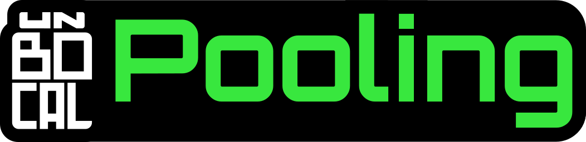

# UnBocal Pooling System  
[See On Github](https://github.com/dlupon/UBPooling){: .btn .btn-purple }

Made by **UnBocal** - **LUPON Dylan**

**Unity 2022.3.62f2 or greater.**

*Simple pooling system for unity. It originaly was made for the game [OOPS! INC](https://store.steampowered.com/widget/4456300).*

## What Is It :
The UBPooling System (for UnBocal Pooling System) is a plugin that will help you optimize you game.

It will let you store objects in pools and call them whenever you want.

## Compatibility & Installation :
You can download the plugin [here](https://github.com/dlupon/UBPooling) on the github page.
This plugin is for **Unity 2022.3.62f2** or greater.

[Download](https://github.com/dlupon/UBPooling/raw/refs/heads/main/UBPoolingSystem.unitypackage){: .btn .btn-purple }